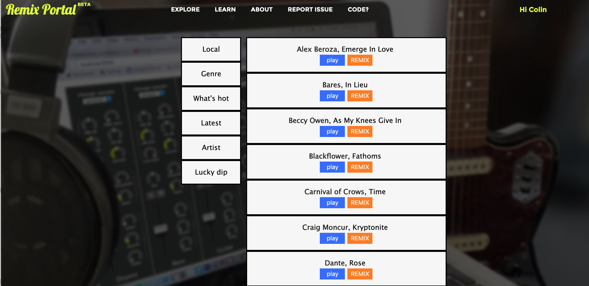
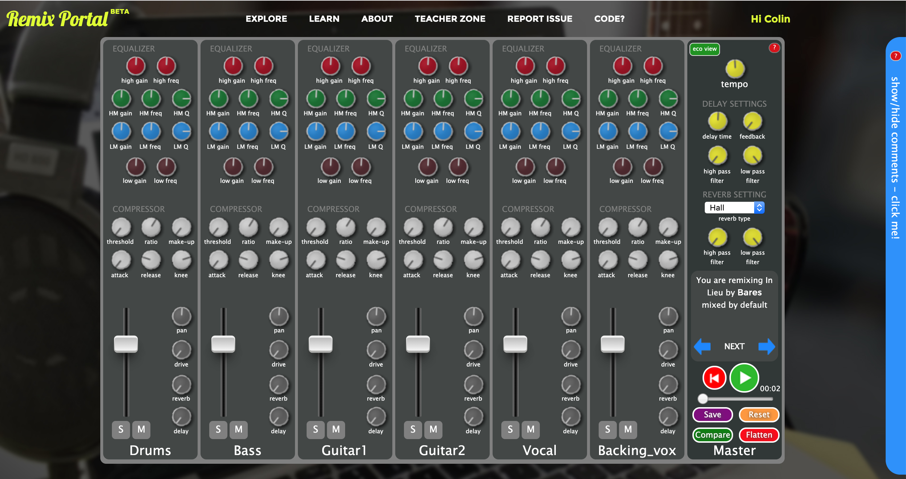
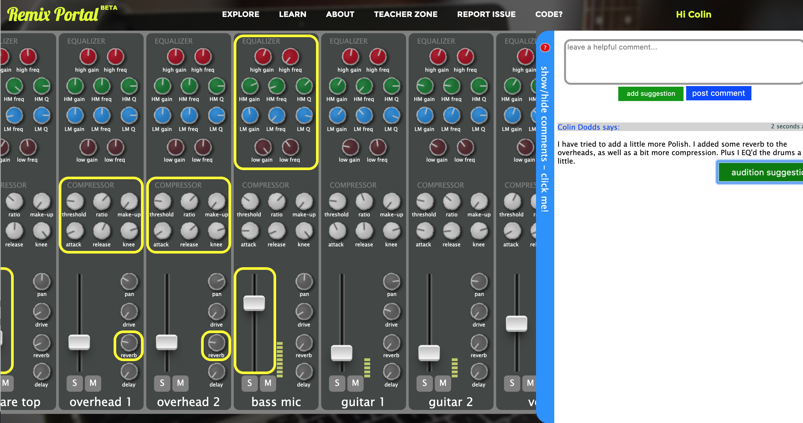
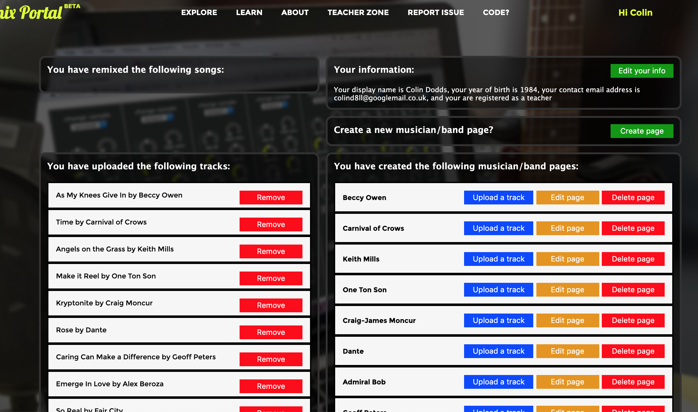

# Remix Portal

This is a web application developed for the Google Chrome desktop browser. It facilitates in-browser music remixing and features collaborative feedback to aid learning. The application was built to support data collection during the authors PhD studies.

## Live demo

You can visit [perth.remixportal.co.uk](https://perth.remixportal.co.uk) for a live demo.

## Using Remix Portal

Once you have the application running in Chrome (either via the live demo or by following the instructions below to get your own copy running in your local host) follow these steps to get started...

**Top menu > Explorer** takes you to the song selection library



Pressing an orange **REMIX** button opens the music mixer with the selected song loaded



Clicking the blue *comments* sidebar opens the feedback panel. Green *audition suggestion* buttons reveals the feedback other users have left



Registered users can leave comments and upload music. To upload music click your username in the top right corner then choose *Profile Page*



## Installation

To install this example on your computer, clone the repository and install
dependencies.

```bash
npm install
```

A MySQL database is required to power the back end. Import the 'sqlStatement' file to quickly setup the database. You will need to provide your own media files however.

Audio file uploading is supported, and uploaded files go to an AWS bucket however as the associated account credentials are not included in the repository you will need to make your own arrangements.

## Usage

```bash
npm start
```

The site will appear in your browser at localhost:3000

## Author

**Colin Bone Dodds** email: colinbonedodds@gmail.com

## License

[MIT](https://choosealicense.com/licenses/mit/)
